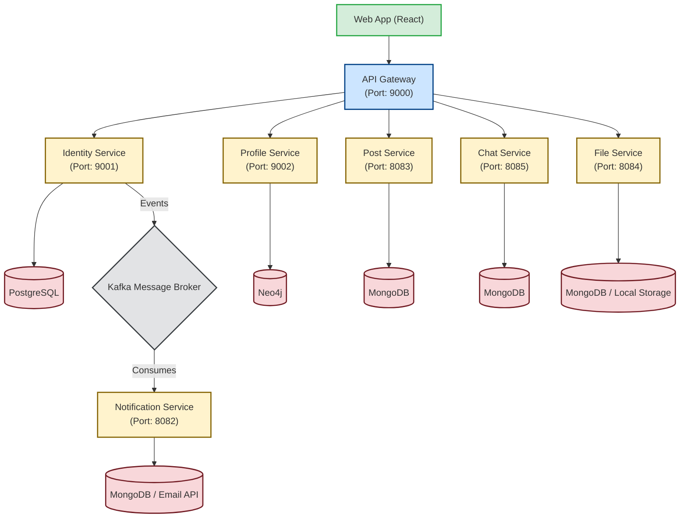

# 🚀 Book Social App - Microservices Architecture

This project is a **microservices-based social networking system** built using Spring Boot technologies and React.
It includes an API Gateway for centralized routing, and several specialized services handling identity, profiles, posts, chats, files, and notifications.

---

## 📦 **All Services Included**

---

### **1. API Gateway**
**Port: 9000**
**Role:**
* Acts as the **single entry point** for all external requests
* Handles **routing**, **request filtering**, and **load balancing**
* Protects internal services from direct external access

**Tech Stack:**
* **Spring Cloud Gateway**

---

### **2. Identity Service**
**Port: 9001**
**Role:**
* Manages **users, passwords, permissions**, and **authentication**
* Issues **JWT tokens** to clients
* Produces Kafka events for other services

**Tech Stack:**
* **Spring Boot**
* **Spring Security**
* **PostgreSQL Database**
* **Apache Kafka (Producer)**

---

### **3. Profile Service**
**Port: 9002**
**Role:**
* Manages **user profile information** after account creation
* Stores relationships between users (e.g., following/followers)

**Tech Stack:**
* **Spring Boot**
* **Neo4j Graph Database**

---

### **4. Notification Service**
**Port: 8082**
**Role:**
* Consumes events via Kafka to send notifications/emails

**Tech Stack:**
* **Spring Boot**
* **MongoDB**
* **Apache Kafka (Consumer)**
* **Brevo Email API**

---

### **5. Post Service**
**Port: 8083**
**Role:**
* Handles creation, retrieval, and management of user posts

**Tech Stack:**
* **Spring Boot**
* **MongoDB**

---

### **6. File Service**
**Port: 8084**
**Role:**
* Manages file uploads (images, attachments) and provides download links

**Tech Stack:**
* **Spring Boot**
* **MongoDB**

---

### **7. Chat Service**
**Port: 8085**
**Role:**
* Manages real-time messages and conversation history between users

**Tech Stack:**
* **Spring Boot**
* **MongoDB**

---

### **8. Web App (Frontend)**
**Role:**
* The client-side application that users interact with.

**Tech Stack:**
* **React**
* **Material-UI (MUI)**
* **React Router**

---

## 🔄 **System Architecture Overview**



---

## 🧰 **Common Technical Features**

* Microservices architecture
* JWT-based authentication
* Distributed communication (Kafka, REST/HTTP)
* Centralized API routing structure

---

## 📁 **Folder Structure**

```text
/api-gateway          # Spring Cloud routing and filters
/identity-service     # Auth, users, PostgreSQL
/profile-service      # Graph relationships, Neo4j
/notification-service # Emails, Kafka consumer, MongoDB
/post-service         # Posts, MongoDB
/chat-service         # Chat, MongoDB
/file-service         # Static assets, MongoDB
/web-app              # React frontend workspace
docker-compose.yml    # Infrastructure definitions
README.md             # This technical document
```

---

## 🧹 **Code Formatting (Spotless)**

Dự án sử dụng **[Spotless Maven Plugin](https://github.com/diffplug/spotless/tree/main/plugin-maven)** `v2.43.0` để đảm bảo code format nhất quán trên tất cả services.

### **Rules áp dụng**

| Rule | Mô tả |
|------|--------|
| `removeUnusedImports` | Tự động xóa các import không sử dụng |
| `trimTrailingWhitespace` | Xóa khoảng trắng thừa cuối dòng |
| `endWithNewline` | Đảm bảo mỗi file kết thúc bằng newline |
| `importOrder` | Sắp xếp imports theo thứ tự: `com → jakarta → lombok → org → java → javax` |

### **Sử dụng**

```bash
# Kiểm tra lỗi format (tự động chạy khi compile)
mvn spotless:check

# Tự động fix tất cả lỗi format
mvn spotless:apply
```

### **Thêm Spotless cho service mới**

Copy đoạn plugin sau vào `<build><plugins>` trong `pom.xml`:

```xml
<plugin>
    <groupId>com.diffplug.spotless</groupId>
    <artifactId>spotless-maven-plugin</artifactId>
    <version>2.43.0</version>
    <configuration>
        <java>
            <removeUnusedImports/>
            <trimTrailingWhitespace/>
            <endWithNewline/>
            <importOrder>
                <order>com,jakarta,lombok,org,java,javax</order>
            </importOrder>
        </java>
    </configuration>
    <executions>
        <execution>
            <phase>compile</phase>
            <goals>
                <goal>check</goal>
            </goals>
        </execution>
    </executions>
</plugin>
```

> **Lưu ý:** File tham khảo cấu hình đầy đủ tại `spotless-config.xml` ở thư mục gốc dự án.

---

## 📌 **Future Improvements**

* Add service discovery (Eureka/Consul)
* Add centralized config system
* Add monitoring (Prometheus + Grafana)
* Add tracing (Zipkin)
