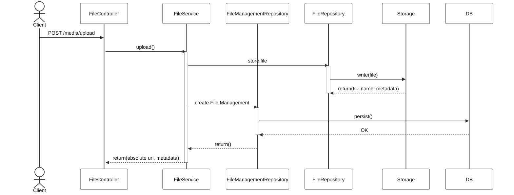

```mermaid
%%{init: {
  "theme": "base",
  "themeVariables": {
    "primaryColor": "#E8F0FE",
    "primaryTextColor": "#111111",
    "primaryBorderColor": "#4A90E2",

    "actorBkg": "#FFFFFF",
    "actorBorder": "#333333",

    "activationBkgColor": "#FFFFFF",
    "activationBorderColor": "#444444",

    "sequenceNumberColor": "#000000",

    "signalColor": "#333333",
    "signalTextColor": "#111111",

    "labelBoxBkgColor": "#F5F5F5",
    "labelBoxBorderColor": "#999999",

    "noteBkgColor": "#FFF8DC",
    "noteBorderColor": "#E6C200"
  }
}}%%

sequenceDiagram

actor Client

participant FileController
participant FileService
participant FileManagementRepository
participant FileRepository
participant Storage
participant DB

Client ->> FileController: POST /media/upload

activate FileController
FileController ->> FileService: upload()

activate FileService
FileService ->> FileRepository: store file

activate FileRepository
FileRepository ->> Storage: write(file)

Storage -->> FileRepository: return(file name, metadata)
deactivate FileRepository

FileService ->> FileManagementRepository: create File Management

activate FileManagementRepository
FileManagementRepository ->> DB: persist()

DB -->> FileManagementRepository: OK
deactivate FileManagementRepository

FileManagementRepository -->> FileService: return()

FileService -->> FileController: return(absolute uri, metadata)

deactivate FileService
```