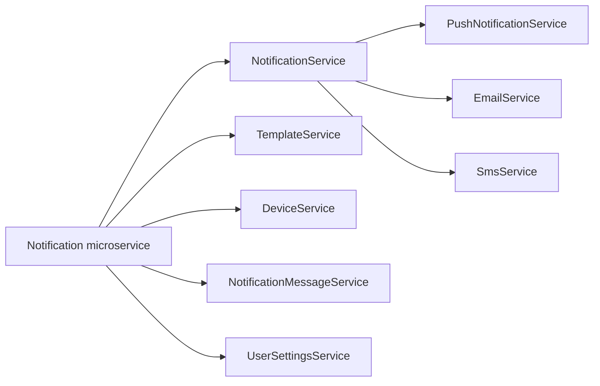

## Prerequisites

### Mongodb
Install Mongodb from Docker Hub:
`docker run -d --name mongodb -p 27017:27017 -e MONGO_INITDB_ROOT_USERNAME=admin -e MONGO_INITDB_ROOT_PASSWORD=admin mongo:latest`

# Notification Microservice Architecture

